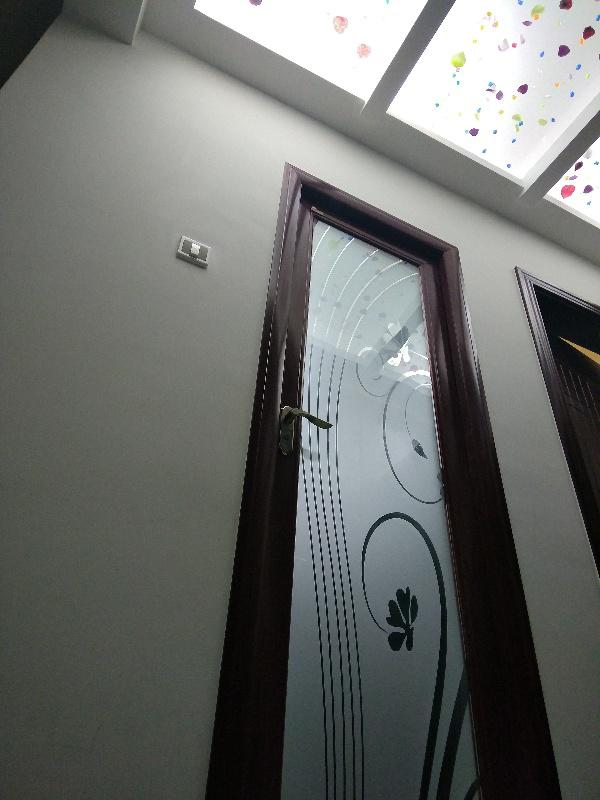
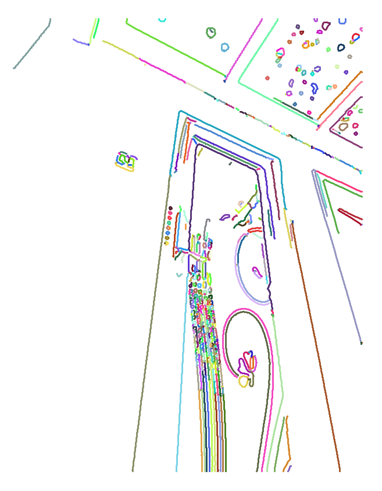
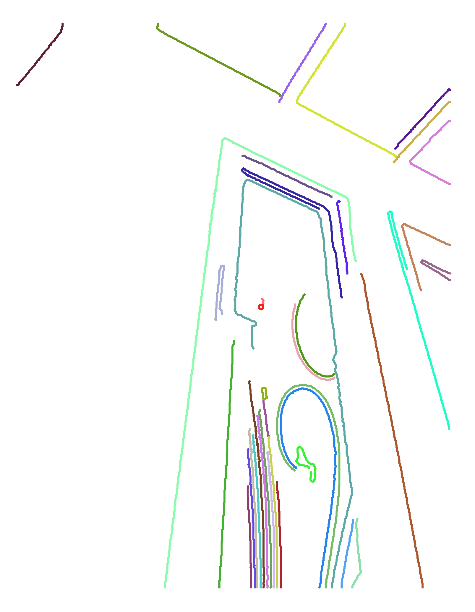
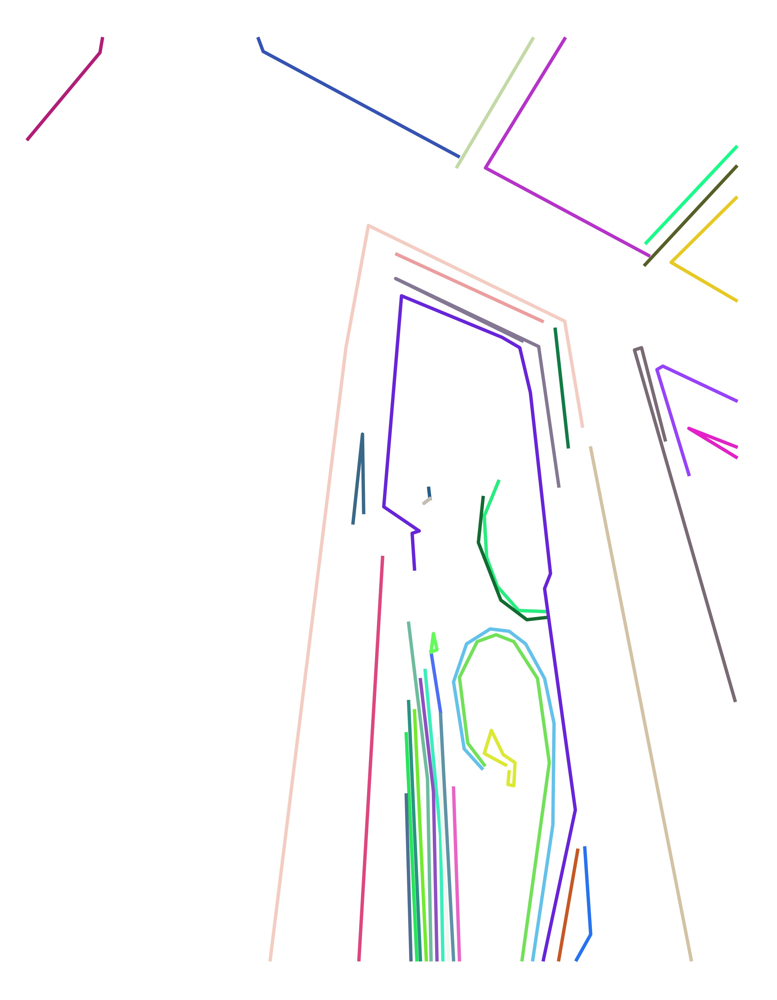
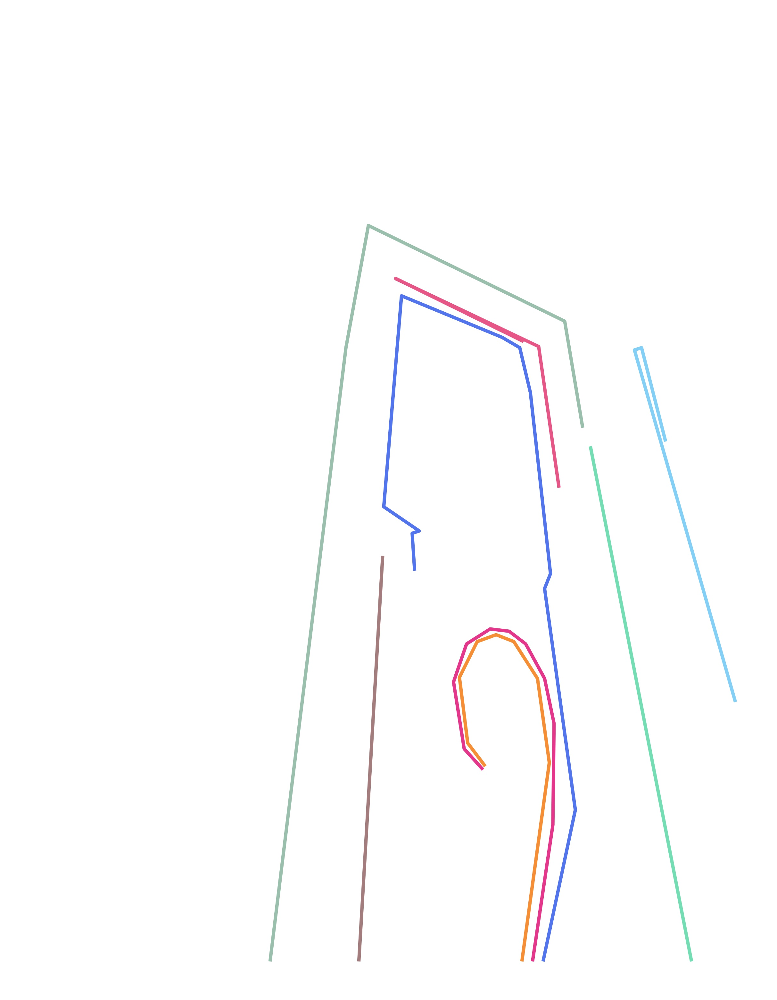

# Edge-Linking-and-Line-Segment-Fitting

## Introduction
A Python version of Peter Kovesi's MATLAB and Octave functions for Computer Vision and Image Processing. This project only contains `<Edge Linking and Line Segment Fitting>` module. The thing I did is rewritting `<Edge Linking and Line Segment Fitting>` module in python.

## Usage
In `edgelink.py`, change your own input path and output path in `line #7` and `line #10` as comments directed.  
If you are not using `<.jpg>` images as input. Then, change the extension in `line #21`.  
Finally, just run `edgelink.py` without parameters. 

## Preview of results
 
 
 
 
 
## Copyright
Copyright (c) 1996-2017 Peter Kovesi  
Centre for Exploration Targeting  
The University of Western Australia  
peter.kovesi at uwa edu au  

Permission is hereby granted, free of charge, to any person obtaining a copy
of this software and associated documentation files (the "Software"), to deal
in the Software without restriction, subject to the following conditions:

The above copyright notice and this permission notice shall be included in 
all copies or substantial portions of the Software.

The Software is provided "as is", without warranty of any kind.

Please visit [Peter's Functions for Computer Vision](https://www.peterkovesi.com/matlabfns/#edgelink) to check the original version.
